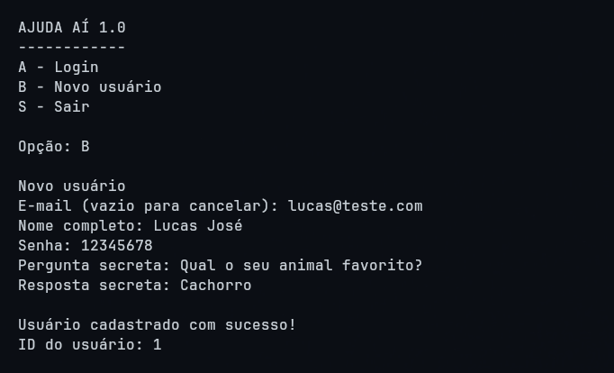
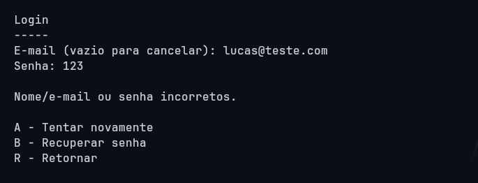
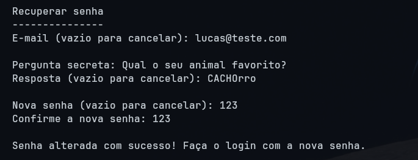
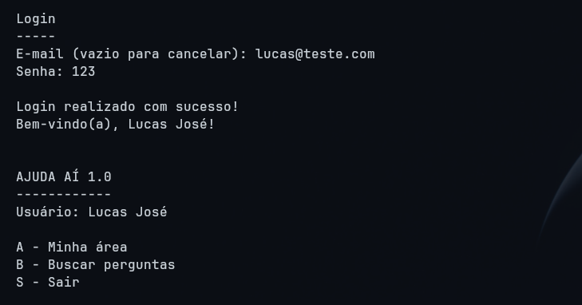
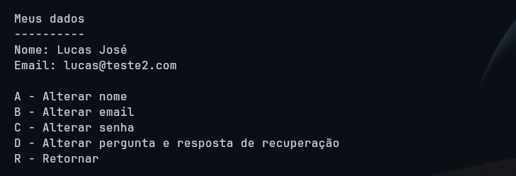
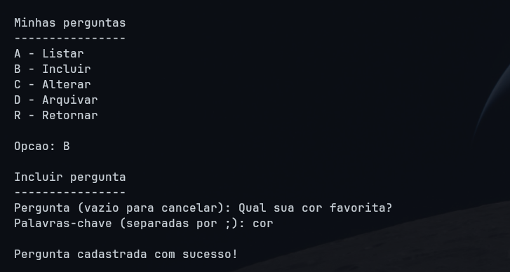
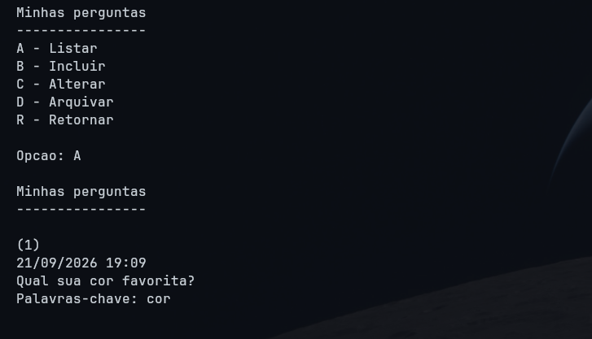
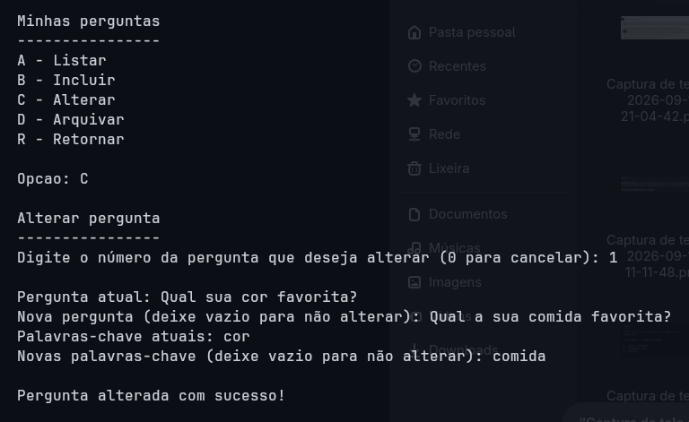
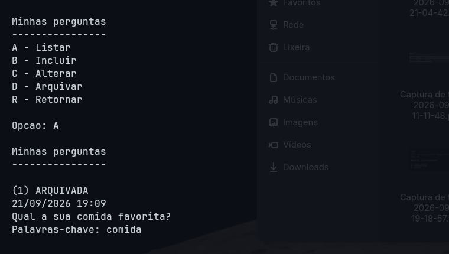
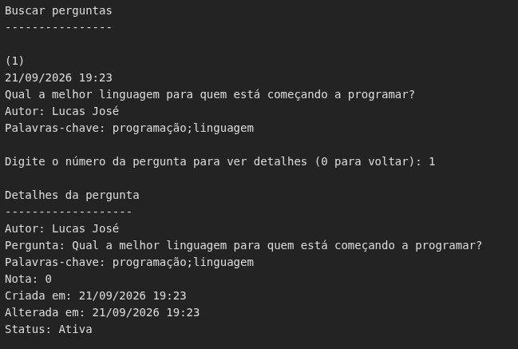

# AJUDA AÍ 1.0 — Trabalho Prático 1 de AEDs III

Sistema de perguntas e respostas em interface textual, construído sobre o CRUD
genérico, a Tabela Hash Extensível e a Árvore B+ vistos em sala.

---

## 1. Participantes

| Participante |
|---|
| Lucas José Souza Rodrigues |
| Luca Maciel |
| Matheus Mendes Senna |
| Saulo |

---

## 2. Como compilar e executar

O projeto não usa nenhuma biblioteca externa nem ferramenta de build. Basta um
JDK instalado (foi testado com o **JDK 26**, e não usa nenhum recurso posterior
ao Java 8).

**Linux / macOS**

```bash
javac -encoding UTF-8 -d bin $(find src -name "*.java")
java -cp bin Principal
```

**Windows (PowerShell)**

```powershell
javac -encoding UTF-8 -d bin (Get-ChildItem -Recurse -Filter *.java src).FullName
java -cp bin Principal
```

Os arquivos de dados e de índice são criados automaticamente na pasta `dados/`,
relativa ao diretório de onde o programa for executado.

---

## 3. O que o sistema faz

O **AJUDA AÍ** é uma versão simplificada de fóruns como o StackOverflow. Cada
pessoa se cadastra, faz login com e-mail e senha, publica perguntas, responde
perguntas de outras pessoas e vota no que considera bom ou ruim.

O fluxo completo é:

1. **Acesso** — a pessoa faz login com e-mail e senha, ou se cadastra no
   primeiro acesso. A senha nunca é armazenada: guardamos apenas o hash SHA-256.
   Se o login falhar, é possível tentar de novo ou recuperar a senha
   respondendo à pergunta secreta cadastrada.
2. **Minha área** — espaço pessoal, onde a pessoa gerencia os próprios dados,
   as próprias perguntas, e consulta as respostas e os votos que já deu.
3. **Minhas perguntas** — CRUD completo das perguntas do usuário logado:
   listar, incluir, alterar e arquivar.
4. **Buscar perguntas** — lista as perguntas ativas de todo o fórum, com o nome
   do autor. A partir daí é possível abrir uma pergunta, ver e escrever
   respostas, e votar tanto na pergunta quanto nas respostas.

Uma pergunta **nunca é excluída fisicamente**, apenas arquivada, conforme o
enunciado. Uma pergunta arquivada some das buscas, não recebe mais respostas e
continua visível apenas para o seu autor, marcada como `ARQUIVADA`.

---

## 4. Organização do projeto

```
TP1_AEDS3/
├── src/
│   ├── Principal.java              ponto de entrada
│   ├── aed3/                       framework fornecido pelo professor
│   ├── entidades/                  as entidades gravadas em arquivo
│   ├── arquivos/                   os CRUDs, que estendem aed3.Arquivo
│   ├── indices/                    os pares chave-valor usados nos índices
│   └── menus/                      visão e controle (interface textual)
├── dados/                          arquivos .db gerados em tempo de execução
├── docs/img/                       capturas de tela
├── bin/                            bytecode (não versionado)
└── README.md                       este relatório
```

### 4.1. Classes criadas pelo grupo

| Classe | Pacote | O que faz |
|---|---|---|
| `Principal` | *(default)* | Ponto de entrada; abre o menu de acesso. |
| `Usuario` | `entidades` | Entidade usuário. Implementa `Registro`, gera os hashes de senha e de resposta secreta. |
| `Pergunta` | `entidades` | Entidade pergunta, com `idUsuario` como chave estrangeira e o campo `ativa`. |
| `Resposta` | `entidades` | Entidade resposta, ligada a uma pergunta e a um usuário. |
| `Voto` | `entidades` | Entidade voto, de `+1` ou `-1`, em uma pergunta ou em uma resposta. |
| `ArquivoUsuario` | `arquivos` | CRUD de usuários. Estende `aed3.Arquivo<Usuario>` e acrescenta o índice indireto de e-mail. |
| `ArquivoPergunta` | `arquivos` | CRUD de perguntas. Estende `aed3.Arquivo<Pergunta>` e acrescenta a Árvore B+ do relacionamento 1:N. |
| `ArquivoResposta` | `arquivos` | CRUD de respostas. Estende `aed3.Arquivo<Resposta>` e acrescenta a Árvore B+ pergunta→respostas. |
| `ArquivoVoto` | `arquivos` | CRUD de votos. Estende `aed3.Arquivo<Voto>` e acrescenta a Árvore B+ usuário→votos. |
| `ParEmailID` | `indices` | Par `(email; idUsuario)` da Tabela Hash Extensível. Implementa `RegistroHashExtensivel`. |
| `ParUsuarioPergunta` | `indices` | Par `(idUsuario; idPergunta)` da Árvore B+. Implementa `InterfaceArvoreBMais`. |
| `ParPerguntaResposta` | `indices` | Par `(idPergunta; idResposta)` da Árvore B+. |
| `ParUsuarioVoto` | `indices` | Par `(idUsuario; idVoto)` da Árvore B+. |
| `MenuAcesso` | `menus` | Tela inicial: login, recuperação de senha e cadastro de novo usuário. |
| `MenuUsuario` | `menus` | Menu principal, Minha área, Meus dados, Buscar perguntas, Meus votos e Minhas respostas. |
| `MenuPerguntas` | `menus` | Menu Minhas perguntas: listar, incluir, alterar e arquivar. |
| `MenuResposta` | `menus` | Menu de respostas de uma pergunta: listar, responder e votar. |
| `Console` | `menus` | Entrada de teclado única, compartilhada por todos os menus. |
| `Formato` | `menus` | Converte os milissegundos das entidades em data e hora legíveis. |

### 4.2. Classes fornecidas pelo professor (pacote `aed3`)

Usadas sem alteração de lógica: `Arquivo`, `Registro`, `HashExtensivel`,
`RegistroHashExtensivel`, `ArvoreBMais`, `InterfaceArvoreBMais` e
`ParIDEndereco`.

A única mudança que fizemos em `Arquivo` foi trocar a barra invertida fixa dos
caminhos (`".\dados\..."`) pela barra normal (`"dados/..."`), porque a barra
invertida só funciona no Windows: em Linux e macOS ela não cria diretórios, e
sim arquivos cujo nome contém barras. A JVM aceita a barra normal nos três
sistemas.

---

## 5. Estrutura dos arquivos e dos índices

Cada entidade tem o seu próprio arquivo, no formato do CRUD genérico: lápide de
1 byte, indicador de tamanho de 2 bytes (`short`) e o vetor de bytes do
registro.

| Arquivo | Índice direto (Hash Extensível) | Índice indireto |
|---|---|---|
| `dados/usuarios/usuarios.db` | `idUsuario` → endereço | **Hash Extensível** `email` → `idUsuario` |
| `dados/perguntas/perguntas.db` | `idPergunta` → endereço | **Árvore B+** `(idUsuario; idPergunta)` |
| `dados/respostas/respostas.db` | `idResposta` → endereço | **Árvore B+** `(idPergunta; idResposta)` |
| `dados/votos/votos.db` | `idVoto` → endereço | **Árvore B+** `(idUsuario; idVoto)` |

O índice direto de cada arquivo é herdado de `aed3.Arquivo`, que já mantém uma
Tabela Hash Extensível de `ParIDEndereco` relacionando o ID do registro ao seu
endereço no arquivo.

---

## 6. Telas do sistema

As telas abaixo são capturas reais da execução, feitas em um terminal. Tanto os
menus quanto o texto digitado aparecem exatamente como o usuário os vê.

> As pastas `docs/img/` estão reservadas para os prints do grupo. Onde houver um
> marcador ``, basta colar o arquivo de imagem correspondente.

### 6.1. Tela de acesso e cadastro de novo usuário



```
AJUDA AÍ 1.0
------------
A - Login
B - Novo usuário
S - Sair

Opção: B

Novo usuário
E-mail (vazio para cancelar): ana@exemplo.com
Nome completo: Ana Ribeiro Costa
Senha: senha123
Pergunta secreta: Qual o nome do meu primeiro animal de estimação?
Resposta secreta: Rex

Usuário cadastrado com sucesso!
ID do usuário: 1
```

O e-mail é verificado antes de qualquer outro dado ser pedido. Se já existir,
o cadastro é interrompido:

```
Novo usuário
E-mail (vazio para cancelar): ana.costa@exemplo.com
Este e-mail já está cadastrado.
```

### 6.2. Login



Login com senha incorreta. O e-mail e a senha são pedidos e conferidos de uma
só vez, e a mensagem é genérica de propósito, para não revelar se o que está
errado é o e-mail ou a senha. Em seguida são oferecidas as opções de tentar
novamente e de recuperar a senha:

```
Login
-----
E-mail (vazio para cancelar): ana@exemplo.com
Senha: senhaErrada

Nome/e-mail ou senha incorretos.

A - Tentar novamente
B - Recuperar senha
R - Retornar

Opção: _
```

Login correto:

```
Login
-----
E-mail (vazio para cancelar): ana@exemplo.com
Senha: senha123

Login realizado com sucesso!
Bem-vindo(a), Ana Ribeiro Costa!
```

### 6.3. Recuperação de senha



Com a resposta errada, a senha não é alterada:

```
Recuperar senha
---------------
E-mail (vazio para cancelar): ana@exemplo.com

Pergunta secreta: Qual o nome do meu primeiro animal de estimação?
Resposta (vazio para cancelar): Bolinha

Resposta incorreta. Não foi possível recuperar a senha.
```

Com a resposta certa, a pessoa define uma nova senha e volta para o login. Note
que a resposta foi digitada como `REX` e a cadastrada era `Rex`: a comparação
ignora maiúsculas e acentos.

```
Recuperar senha
---------------
E-mail (vazio para cancelar): ana@exemplo.com

Pergunta secreta: Qual o nome do meu primeiro animal de estimação?
Resposta (vazio para cancelar): REX

Nova senha (vazio para cancelar): novaSenha456
Confirme a nova senha: novaSenha456

Senha alterada com sucesso! Faça o login com a nova senha.

Login
-----
E-mail (vazio para cancelar): ana@exemplo.com
Senha: novaSenha456

Login realizado com sucesso!
Bem-vindo(a), Ana Ribeiro Costa!
```

### 6.4. Menu principal e Minha área



```
AJUDA AÍ 1.0
------------
Usuário: Ana Ribeiro Costa

A - Minha área
B - Buscar perguntas
S - Sair

Opção: A

Minha área
----------
A - Meus dados
B - Minhas perguntas
C - Minhas respostas
D - Meus votos
R - Retornar

Opção: B
```

### 6.5. Meus dados — alteração de e-mail



```
Meus dados
----------
Nome: Ana Ribeiro Costa
Email: ana@exemplo.com

A - Alterar nome
B - Alterar email
C - Alterar senha
D - Alterar pergunta e resposta de recuperação
R - Retornar

Opção: B

Novo e-mail (vazio para cancelar): ana.costa@exemplo.com

E-mail alterado com sucesso!

Meus dados
----------
Nome: Ana Ribeiro Costa
Email: ana.costa@exemplo.com
```

E o login passa a funcionar com o novo e-mail, o que comprova que o índice
indireto foi atualizado:

```
Login
-----
E-mail (vazio para cancelar): ana.costa@exemplo.com
Senha: senha123

Login realizado com sucesso!
```

### 6.6. Minhas perguntas — inclusão



```
Minhas perguntas
----------------
A - Listar
B - Incluir
C - Alterar
D - Arquivar
R - Retornar

Opcao: B

Incluir pergunta
----------------
Pergunta (vazio para cancelar): É seguro comer pão mofado, se você cortar a parte mofada fora?
Palavras-chave (separadas por ;): pão;mofado;saúde

Pergunta cadastrada com sucesso!
```

### 6.7. Minhas perguntas — listagem



As perguntas são numeradas sequencialmente na tela, com a data e a hora de
criação. Nem o ID da pergunta nem o ID do usuário aparecem, porque são dados de
uso interno do sistema.

```
Minhas perguntas
----------------

(1)
19/09/2026 13:56
É seguro comer pão mofado, se você cortar a parte mofada fora?
Palavras-chave: pão;mofado;saúde

(2)
19/09/2026 13:56
Para quem está começando a programar agora, qual a linguagem recomendada?
Palavras-chave: programação;linguagem

(3)
19/09/2026 13:57
Por que a luz azul das telas atrapalha o nosso sono?
Palavras-chave: luz azul;sono
```

### 6.8. Minhas perguntas — alteração



```
Alterar pergunta
----------------
Digite o número da pergunta que deseja alterar (0 para cancelar): 2

Pergunta atual: Para quem está começando a programar agora, qual a linguagem recomendada?
Nova pergunta (deixe vazio para não alterar): Para quem está começando a programar agora, qual linguagem é a mais recomendada?
Palavras-chave atuais: programação;linguagem
Novas palavras-chave (deixe vazio para não alterar):

Pergunta alterada com sucesso!
```

### 6.9. Minhas perguntas — arquivamento



```
Arquivar pergunta
-----------------
Digite o número da pergunta que deseja arquivar (0 para cancelar): 3

Pergunta: Por que a luz azul das telas atrapalha o nosso sono?
Confirma o arquivamento desta pergunta? (S/N): S

Pergunta arquivada com sucesso!
```

Depois do arquivamento, a pergunta continua aparecendo para o autor, agora
marcada, e some das buscas dos outros usuários:

```
Minhas perguntas
----------------

(1)
19/09/2026 13:56
É seguro comer pão mofado, se você cortar a parte mofada fora?
Palavras-chave: pão;mofado;saúde

(2)
19/09/2026 13:56
Para quem está começando a programar agora, qual linguagem é a mais recomendada?
Palavras-chave: programação;linguagem

(3) ARQUIVADA
19/09/2026 13:57
Por que a luz azul das telas atrapalha o nosso sono?
Palavras-chave: luz azul;sono
```

### 6.10. Buscar perguntas



Note que a pergunta 3, arquivada, não aparece na busca:

```
Buscar perguntas
----------------

(1)
19/09/2026 13:56
É seguro comer pão mofado, se você cortar a parte mofada fora?
Autor: Ana Ribeiro Costa
Palavras-chave: pão;mofado;saúde

(2)
19/09/2026 13:56
Para quem está começando a programar agora, qual linguagem é a mais recomendada?
Autor: Ana Ribeiro Costa
Palavras-chave: programação;linguagem

Digite o número da pergunta para ver detalhes (0 para voltar): 1

Detalhes da pergunta
--------------------
Autor: Ana Ribeiro Costa
Pergunta: É seguro comer pão mofado, se você cortar a parte mofada fora?
Palavras-chave: pão;mofado;saúde
Nota: 0
Criada em: 19/09/2026 13:56
Alterada em: 19/09/2026 13:56
Status: Ativa
```

### 6.11. Respostas e votos


```
Pergunta selecionada
--------------------
É seguro comer pão mofado, se você cortar a parte mofada fora?

A - Listar respostas
B - Responder
C - Votar na resposta
R - Retornar

Opção: B

Responder pergunta
-----------------
Texto da resposta (vazio para cancelar): Não é seguro. O mofo espalha filamentos invisíveis por todo o pão, então o ideal é descartar a peça inteira.

Resposta cadastrada com sucesso!
```

```
Votar em resposta
-----------------

1 - Não é seguro. O mofo espalha filamentos invisíveis por todo o pão, então o ideal é descartar a peça inteira.
Autor: Bruno Alves Pinto
Nota atual: 0

Digite o número da resposta para votar (0 para cancelar): 1
Valor do voto (+1 ou -1): 1

Voto registrado com sucesso!
```

O sistema recusa voto repetido e voto no próprio conteúdo:

```
Você já votou nesta pergunta.
```
```
Você não pode votar na própria pergunta.
```

### 6.12. Meus votos


```
Meus votos
----------

1 - Voto em resposta: Não é seguro. O mofo espalha filamentos invisíveis por todo o pão, então o ideal é descartar a peça inteira.
Valor: 1
```

---

## 7. Operações especiais implementadas

### 7.1. Hash da senha e da resposta secreta

A senha nunca é gravada em arquivo. `Usuario.gerarHash()` aplica **SHA-256** e
converte o resultado para hexadecimal; o login compara hashes, nunca textos.

A resposta secreta recebe um tratamento a mais antes do hash, em
`Usuario.gerarHashResposta()`: o texto é normalizado em **NFD**, as marcas de
acentuação são removidas com a expressão `\p{M}` e tudo vira minúsculo. Assim,
`"São Paulo"`, `"sao paulo"` e `"SAO PAULO"` produzem o mesmo hash, e um
acento esquecido na hora de recuperar a senha não impede o acesso.

### 7.2. Recuperação de senha pela pergunta secreta

Como a senha só existe em forma de hash, não há como devolvê-la ao usuário. A
recuperação, então, redefine a senha depois de conferir a resposta secreta.

O fluxo começa quando o login falha. Em vez de simplesmente voltar ao menu, o
sistema oferece três saídas — tentar novamente, recuperar a senha ou retornar —
conforme o enunciado pede. Escolhida a recuperação, `MenuAcesso.recuperarSenha()`
localiza o usuário pelo e-mail (usando o índice indireto), apresenta a
`perguntaSecreta` gravada e compara a resposta digitada:

```java
if(!Usuario.gerarHashResposta(resposta).equals(usuario.hashRespostaSecreta)) {
    System.out.println("\nResposta incorreta. Não foi possível recuperar a senha.");
    return false;
}
```

A comparação passa pelo mesmo `gerarHashResposta()` do cadastro, então a
normalização descrita em 7.1 vale aqui: quem cadastrou `"Rex"` consegue entrar
digitando `"REX"` ou `"rex"`, e um acento esquecido não bloqueia o acesso.
Conferida a resposta, a nova senha é pedida duas vezes, tem o hash gerado e é
gravada com `arqUsuarios.update()`. O usuário volta direto para a tela de login.

Uma decisão de segurança acompanha isso: o login passou a pedir o e-mail **e** a
senha antes de validar qualquer um dos dois. Antes, um e-mail inexistente era
recusado sem que a senha fosse sequer pedida, o que revelava quais e-mails estão
cadastrados. Agora os dois são conferidos de uma só vez e a mensagem de erro é a
mesma nos dois casos, como o enunciado determina.

### 7.3. Datas de criação e de alteração

As entidades guardam data e hora como `long` em milissegundos, conforme o
enunciado. Esse formato não serve para leitura, então toda tela que mostra uma
data passa por `Formato.dataHora()`, que converte para `dd/MM/yyyy HH:mm` no
fuso do computador.

O campo `alteracao` é atualizado automaticamente em toda modificação da
pergunta — tanto na alteração de texto e palavras-chave quanto no arquivamento:

```java
p.alteracao = System.currentTimeMillis();
```

A data de criação aparece acima de cada pergunta nas duas listagens, *Minhas
perguntas* e *Buscar perguntas*, e a tela de detalhes mostra as duas datas, o
que permite ver quando uma pergunta foi editada pela última vez.

### 7.4. Índice indireto de e-mail em Tabela Hash Extensível

`ArquivoUsuario` mantém uma `HashExtensivel<ParEmailID>` que relaciona o e-mail
ao `idUsuario`. É ela que permite o login — a busca é pelo e-mail, mas o
registro é localizado pelo ID.

O ponto delicado é que **o e-mail pode mudar e o ID não**. Por isso
`ArquivoUsuario.update()` compara o e-mail antigo com o novo e, se mudou,
remove a entrada antiga do índice e cria a nova:

```java
if(novoUsuario.getEmail().compareTo(usuarioVelho.getEmail()) != 0) {
    indiceIndiretoEmail.delete(ParEmailID.hash(usuarioVelho.getEmail()));
    indiceIndiretoEmail.create(new ParEmailID(novoUsuario.getEmail(), novoUsuario.getId()));
}
```

`ArquivoUsuario.delete()` também foi sobrescrito, nas duas formas (por ID e por
e-mail), para que o índice nunca fique apontando para um registro que não
existe mais.

Como a Tabela Hash Extensível exige registros de tamanho fixo, `ParEmailID`
grava o e-mail em um bloco fixo de 100 bytes, completado com zeros, mais 4
bytes do ID — 104 bytes por entrada.

### 7.5. Árvore B+ do relacionamento 1:N entre usuários e perguntas

Este é o relacionamento central do trabalho. A chave estrangeira `idUsuario`
dentro de `Pergunta` resolve o caminho *pergunta → autor*. Para o caminho
inverso, *usuário → suas perguntas*, existe a `ArvoreBMais<ParUsuarioPergunta>`
de ordem 5, mantida por `ArquivoPergunta`.

Toda pergunta criada insere o par na árvore, na mesma operação:

```java
@Override
public int create(Pergunta p) throws Exception {
    int id = super.create(p);
    indiceUsuarioPergunta.create(new ParUsuarioPergunta(p.getIdUsuario(), id));
    return id;
}
```

A comparação em `ParUsuarioPergunta.compareTo()` é feita primeiro por
`idUsuario` e só depois por `idPergunta`. É isso que faz com que todas as
perguntas de um mesmo usuário fiquem **contíguas nas folhas da árvore**, que é
justamente o que caracteriza o relacionamento 1:N.

O mesmo padrão se repete em `ArquivoResposta`, com o par
`(idPergunta; idResposta)`, e em `ArquivoVoto`, com o par `(idUsuario; idVoto)`.

### 7.6. Arquivamento no lugar da exclusão

Perguntas não são apagadas. O campo `boolean ativa` passa a `false` e a data de
alteração é atualizada. O arquivamento é definitivo: não existe opção de
desarquivar em nenhum menu. Uma pergunta arquivada:

- some da tela **Buscar perguntas**, que filtra por `p.ativa`;
- continua na listagem do autor, marcada com `ARQUIVADA`;
- não aceita novas respostas — `MenuResposta.menu()` recusa a entrada logo no
  início se a pergunta estiver inativa.

Isso preserva as respostas e os votos que outras pessoas já deixaram, que é
exatamente o motivo pelo qual o enunciado pede arquivamento em vez de exclusão.

### 7.7. Mapeamento entre número de tela e ID real

Os IDs são internos e não devem aparecer para o usuário. Mas a interface é
textual e a pessoa precisa de alguma forma indicar sobre qual pergunta quer
agir. A solução é um `ArrayList<Integer> mapPerguntas` que guarda, na ordem em
que as perguntas foram impressas, o ID real de cada uma. O usuário digita o
número da tela e o sistema converte:

```java
int idReal = mapPerguntas.get(numero - 1);
Pergunta p = arqPerguntas.read(idReal);
```

O mesmo recurso é usado em `MenuUsuario.buscarPerguntas()` e em
`MenuResposta.votarResposta()`.

### 7.8. Votação com nota acumulada

Um voto vale `+1` ou `-1` e é gravado como um registro próprio na entidade
`Voto`, o que permite auditar quem votou em quê. A nota da pergunta ou da
resposta é atualizada junto, no mesmo fluxo.

Duas regras são verificadas antes de aceitar um voto:

- **ninguém vota no próprio conteúdo** — comparação entre o `idUsuario` do voto
  e o autor do conteúdo;
- **ninguém vota duas vezes no mesmo conteúdo** — a Árvore B+
  `(idUsuario; idVoto)` é percorrida procurando um voto já existente daquele
  usuário para aquela pergunta ou resposta.

Um voto em pergunta é gravado com `idResposta = -1`, o que distingue os dois
tipos de voto na listagem de **Meus votos**.

### 7.9. Reuso do espaço de registros excluídos

Herdado de `aed3.Arquivo` e ativo em todos os CRUDs. O cabeçalho do arquivo
mantém uma lista encadeada de espaços livres, ordenada por tamanho
(`addDeleted()` / `getDeleted()`). Quando um registro é criado, o sistema
procura primeiro um espaço livre grande o bastante antes de crescer o arquivo.

Isso também aparece no `update()`: se o registro alterado couber no espaço
antigo, ele é sobrescrito no lugar; se não couber, o espaço antigo entra na
lista de livres, o registro é gravado em outro ponto e o índice direto é
atualizado com o novo endereço.

### 7.10. Entrada de teclado única

Cada menu tinha o seu próprio `Scanner` sobre o `System.in`. Como cada
`Scanner` lê um bloco inteiro da entrada para o seu buffer interno, as linhas
que sobravam se perdiam quando o controle passava de um menu para outro. Todos
os menus agora compartilham a mesma instância, em `menus.Console`.

---

## 8. Checklist

> **Há um CRUD de usuários (que estende a classe Arquivo, acrescentando Tabelas
> Hash Extensíveis e Árvores B+ como índices diretos e indiretos conforme
> necessidade) que funciona corretamente?**

**Sim.** `ArquivoUsuario` estende `aed3.Arquivo<Usuario>`, herdando o índice
direto em Tabela Hash Extensível (`idUsuario` → endereço), e acrescenta um
índice indireto, também em Tabela Hash Extensível, de `email` → `idUsuario`. As
quatro operações funcionam: criar (cadastro de novo usuário), ler (por ID e por
e-mail, usado no login), atualizar (nome, e-mail, senha e dados de recuperação,
com o índice de e-mail sendo corrigido quando o e-mail muda) e excluir (por ID
e por e-mail, removendo também a entrada do índice).

Não usamos Árvore B+ neste CRUD porque, conforme a ressalva do próprio
enunciado, ela só é acrescentada "conforme necessidade": o relacionamento 1:N
entre usuários e perguntas é percorrido a partir do arquivo de perguntas, e por
isso a árvore correspondente pertence a `ArquivoPergunta`.

> **Há um CRUD de perguntas (que estende a classe Arquivo, acrescentando
> Tabelas Hash Extensíveis e Árvores B+ como índices diretos e indiretos
> conforme necessidade) que funciona corretamente?**

**Sim.** `ArquivoPergunta` estende `aed3.Arquivo<Pergunta>`, herdando o índice
direto em Tabela Hash Extensível (`idPergunta` → endereço), e acrescenta a
Árvore B+ de `(idUsuario; idPergunta)`. As operações de listar, incluir,
alterar e arquivar estão implementadas em `MenuPerguntas` e funcionam.

Uma observação sobre a letra D do CRUD: **não há exclusão física de perguntas**,
e isso é intencional. O enunciado determina que "não faremos a exclusão de
perguntas [...] permitiremos apenas o arquivamento", e que "o arquivamento será
definitivo". O que implementamos é a exclusão lógica pelo campo `ativa`,
exatamente como pedido.

> **As perguntas estão vinculadas aos usuários usando o idUsuario como chave
> estrangeira?**

**Sim.** A classe `Pergunta` tem o atributo `int idUsuario`, gravado e lido no
`toByteArray()` / `fromByteArray()`. Ele é preenchido automaticamente com o ID
do usuário logado no momento da criação, em `MenuPerguntas.incluir()`, e nunca
pode ser alterado pela interface — não existe opção de mudar o autor de uma
pergunta.

Sobre a integridade referencial: como o `idUsuario` sempre vem do usuário que
está autenticado no sistema, é impossível criar uma pergunta apontando para um
usuário inexistente.

> **Há uma árvore B+ que registre o relacionamento 1:N entre usuários e
> perguntas?**

**Sim.** É a `ArvoreBMais<ParUsuarioPergunta>` de ordem 5, mantida por
`ArquivoPergunta` no arquivo `dados/perguntas/indiceUsuarioPergunta.db`. A
classe `ParUsuarioPergunta` implementa `InterfaceArvoreBMais` e compara primeiro
por `idUsuario`, depois por `idPergunta`, mantendo as perguntas de um mesmo
usuário contíguas nas folhas. É essa árvore que responde à pergunta "quais são
as perguntas deste usuário?" sem percorrer o arquivo inteiro, e é ela que
alimenta a tela **Minhas perguntas**.

> **O trabalho compila corretamente?**

**Sim.** Compila sem nenhum erro e sem nenhum aviso, com o comando da seção 2
deste relatório. Foi verificado com o JDK 26 em Linux.

> **O trabalho está completo e funcionando sem erros de execução?**

**Sim.** Todas as operações pedidas para esta etapa estão implementadas e
funcionam sem nenhuma exceção em tempo de execução. As seções 6.1 a 6.12 deste
relatório são capturas reais de uma execução completa, e cobrem exatamente os
pontos exigidos:

| Operação exigida | Onde está | Tela |
|---|---|---|
| Cadastro de um novo usuário | `MenuAcesso.novoUsuario()` | 6.1 |
| Login falhando e recuperação de senha | `MenuAcesso.login()`, `falhaNoLogin()`, `recuperarSenha()` | 6.2 e 6.3 |
| Login correto | `MenuAcesso.login()` | 6.2 |
| Atualização do e-mail do usuário | `MenuUsuario.alterarEmail()`, `ArquivoUsuario.update()` | 6.5 |
| Cadastro de uma pergunta | `MenuPerguntas.incluir()` | 6.6 |
| Listagem de perguntas | `MenuPerguntas.listar()` | 6.7 |
| Atualização de uma pergunta | `MenuPerguntas.alterar()` | 6.8 |
| Arquivamento de uma pergunta | `MenuPerguntas.arquivar()` | 6.9 |

Além do exigido, também estão funcionando as respostas, os votos em perguntas e
em respostas, e as telas *Minhas respostas* e *Meus votos*, que adiantam parte
do segundo trabalho prático.

Verificamos clonando o repositório em uma pasta limpa, apagando `dados/` e
executando o roteiro completo do zero: a compilação não emite nenhum erro nem
aviso, e a execução vai do cadastro ao voto sem nenhuma exceção.

> **O trabalho é original e não a cópia de um trabalho de outro grupo?**

**Sim.** Todo o código das classes listadas na seção 4.1 foi escrito pelo grupo.
As classes do pacote `aed3` são as fornecidas pelo professor, usadas conforme o
enunciado determina, e a única alteração que fizemos nelas está documentada na
seção 4.2. O histórico de commits do repositório mostra a evolução do trabalho e
a contribuição de cada participante.
